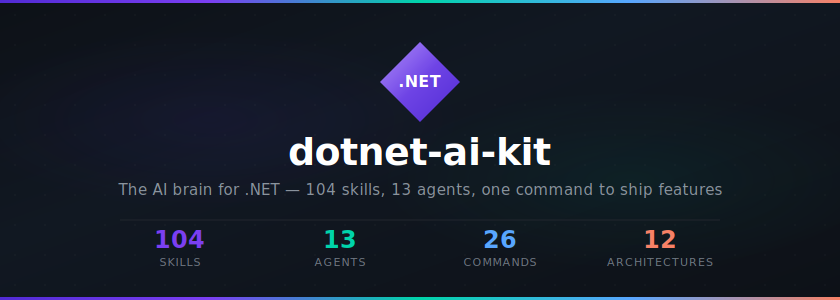
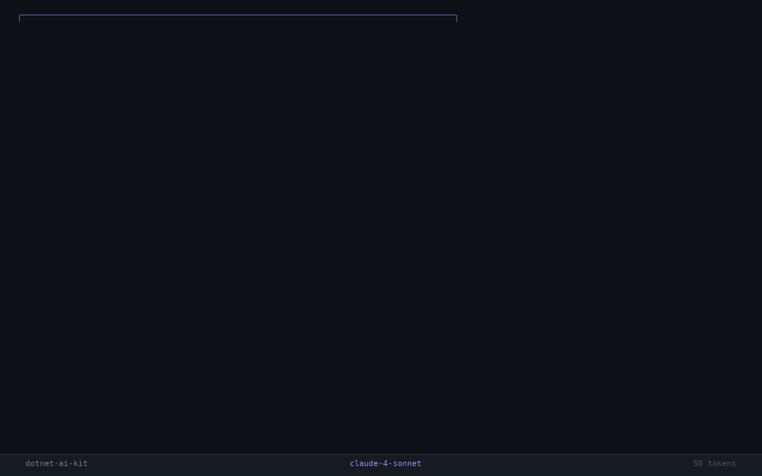
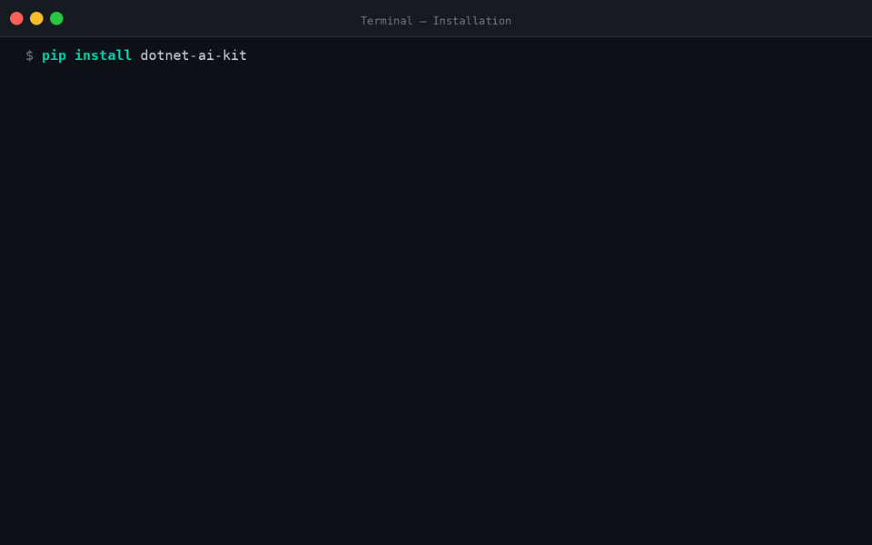
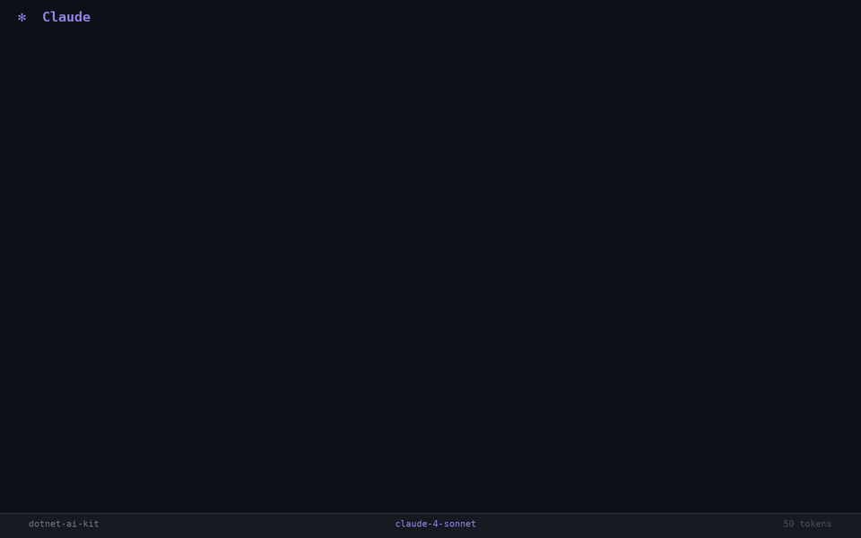

<p align="center">
  
</p>

<h3 align="center">The AI brain for .NET — 120 skills, 13 agents, one command to ship features</h3>

<p align="center">
  <a href="https://github.com/FaysilAlshareef/dotnet-ai-kit/releases"></a>
  <a href="LICENSE"></a>
  <a href="https://www.python.org/"></a>
  <a href="https://dotnet.microsoft.com/"></a>
  <a href="https://github.com/FaysilAlshareef/dotnet-ai-kit"></a>
  <a href="https://github.com/FaysilAlshareef/dotnet-ai-kit/stargazers"></a>
</p>

<p align="center">
  <code>120 skills</code> · <code>13 agents</code> · <code>27 commands</code> · <code>16 rules</code> · <code>12 architectures</code> · <code>4 safety hooks</code> · <code>13 templates</code>
</p>

---

## The Problem

When you use AI coding assistants on .NET projects, the AI doesn't know your architecture. It generates **layered code in your VSA project**, **anemic models in your DDD project**, and **everything in one repo for your CQRS microservices**. You spend hours fixing AI output to match your patterns.

**dotnet-ai-kit fixes this.** It gives AI deep .NET intelligence — your architecture, your conventions, your lifecycle — so every line of generated code fits your project.

---

## See It in Action

<p align="center">
  
  <br/>
  <sub><code>/dai.do</code> running the full 9-phase lifecycle inside Claude Code</sub>
</p>

---

## Quick Start

### CLI Installation

```bash
# Install the CLI
uv tool install dotnet-ai-kit --from git+https://github.com/FaysilAlshareef/dotnet-ai-kit.git

# Initialize your project (auto-detects architecture)
dotnet-ai init . --ai claude

# Build a complete feature with one command
/dai.do "Add order management with tracking"

# That's it → spec → plan → code → test → review → PR
```

<details>
<summary><b>See installation demo</b></summary>
<br/>
<p align="center">
  
</p>
</details>

### Claude Code Plugin (Recommended)

```bash
# Add the marketplace
/plugin marketplace add FaysilAlshareef/dotnet-ai-kit

# Install
/plugin install dotnet-ai-kit
```

All 27 commands, 120 skills, 13 agents, 16 rules, and 4 safety hooks are available immediately.

<details>
<summary><b>See plugin install demo</b></summary>
<br/>
<p align="center">
  
</p>
</details>

### Optional: C# Language Intelligence

```bash
dotnet tool install -g csharp-ls
```

Enables semantic code navigation via MCP — ~10x fewer tokens than grep-based analysis.

---

## Security & Permissions

### What the Plugin Accesses

- **Reads**: `.csproj`, `.sln`, source files (for architecture detection and code generation)
- **Writes**: Generated code files, configuration in `.dotnet-ai-kit/`, feature specs in `specs/`
- **Executes**: `dotnet` CLI commands (build, test, format, restore, new)

### Safety Hooks (4 automatic guards)

| Hook | Event | What It Does |
|------|-------|-------------|
| **bash-guard** | Before any bash command | Blocks 20+ dangerous patterns (`rm -rf /`, `DROP TABLE`, `format C:`, etc.) |
| **commit-lint** | Before `git commit` | Verifies C# formatting passes before allowing commit |
| **edit-format** | After editing `.cs` files | Auto-runs `dotnet format` on the changed file |
| **scaffold-restore** | After `dotnet new` | Auto-runs `dotnet restore` to resolve packages |

All hooks can be disabled via environment variables (e.g., `DOTNET_AI_HOOK_BASH_GUARD=false`).

### Permission Levels

| Level | Scope | Best For |
|-------|-------|---------|
| **Minimal** | `dotnet build`, `dotnet test`, `git status` only | CI/CD environments, read-only review |
| **Standard** | + `git`, `gh`, file operations, search tools | Daily development (recommended) |
| **Full** | All working directory operations | Trusted environments with full autonomy |

### What the Plugin Does NOT Do

- Never deploys to any environment (deployments are handled by CI/CD pipelines)
- Never pushes to remote without explicit user confirmation
- Never deletes files outside the working directory
- Never accesses network services beyond configured domains (github.com, learn.microsoft.com)
- Never modifies `.git/` internals or CI/CD pipeline configuration without asking

---

## One Command, Full Feature

```
/dai.do "Add order management with status tracking and notifications"
```

This single command automatically runs the full 9-phase lifecycle:

```
 specify → clarify → plan → tasks → analyze → implement → review → verify → PR
```

| Phase | Command | What Happens |
|-------|---------|-------------|
| 1 | `/dai.spec` | Generates structured feature specification |
| 2 | `/dai.clarify` | Asks up to 3 smart clarifying questions |
| 3 | `/dai.plan` | Creates detailed implementation plan |
| 4 | `/dai.tasks` | Breaks plan into executable tasks |
| 5 | `/dai.check` | Analyzes plan for architecture compliance |
| 6 | `/dai.go` | Implements all code (entities, endpoints, handlers, tests) |
| 7 | `/dai.review` | Code review against YOUR project standards |
| 8 | `/dai.verify` | Verifies build, tests, and quality gates |
| 9 | `/dai.pr` | Creates PR with full description |

**Simple features** (<10 tasks): fully automatic · **Complex features** (multi-repo): pauses after plan for confirmation · **Always** supports `--dry-run` to preview first

<details>
<summary><b>See the full SDD lifecycle demo</b></summary>
<br/>
<p align="center">
  
</p>
</details>

---

## What's Inside

<table>
<tr><td>

### 120 Skills (17 categories)

| Category | Count |
|----------|:-----:|
| Microservice | 33 |
| Core (C#) | 12 |
| API | 11 |
| Data (EF Core) | 8 |
| Docs | 8 |
| Architecture | 7 |
| CQRS | 6 |
| DevOps | 5 |
| Security | 5 |
| Workflow | 5 |
| Infrastructure | 4 |
| Testing | 4 |
| Observability | 3 |
| Quality | 3 |
| Resilience | 3 |
| Detection | 1 |

</td><td>

### 13 Specialist Agents

| Agent | Domain |
|-------|--------|
| `dotnet-architect` | Architecture decisions |
| `api-designer` | REST, Minimal APIs, gRPC |
| `ef-specialist` | EF Core, migrations |
| `command-architect` | Event-sourced write side |
| `query-architect` | SQL Server read side |
| `cosmos-architect` | Cosmos DB read models |
| `gateway-architect` | API Gateway, routing |
| `processor-architect` | Background processing |
| `controlpanel-architect` | Blazor WASM |
| `test-engineer` | Unit + integration tests |
| `reviewer` | Code review, quality |
| `devops-engineer` | Docker, Azure, CI/CD |
| `docs-engineer` | API docs, standards |

</td></tr>
</table>

### 16 Convention Rules (Always Active)

| Rule | Purpose |
|------|---------|
| `api-design` | REST conventions, versioning, error responses |
| `architecture` | Enforces architectural boundaries |
| `async-concurrency` | Async/await patterns, CancellationToken propagation |
| `coding-style` | Code formatting and patterns |
| `configuration` | Options pattern, ValidateOnStart |
| `data-access` | EF Core patterns, repository structure |
| `error-handling` | Exception handling, validation |
| `existing-projects` | Respects your existing codebase patterns |
| `localization` | Resource files, culture handling |
| `multi-repo` | Event contract ownership, cross-repo branch naming, deploy order |
| `naming` | C# naming conventions, namespaces |
| `observability` | Structured logging, metrics, tracing |
| `performance` | Query optimization, caching patterns |
| `security` | Auth, secrets, input validation |
| `testing` | Test naming, AAA structure, CQRS patterns |
| `tool-calls` | Sequential tool usage, verification |

### 4 Safety Hooks

| Hook | What It Prevents |
|------|-----------------|
| `pre-bash-guard.sh` | Blocks destructive commands (`rm -rf`, `git reset --hard`) |
| `post-edit-format.sh` | Auto-formats C# files after every edit |
| `post-scaffold-restore.sh` | Auto-runs `dotnet restore` after scaffolding |
| `pre-commit-lint.sh` | Verifies formatting before git commit |

<details>
<summary><b>See safety hooks in action</b></summary>
<br/>
<p align="center">
  
</p>
</details>

### 3 Permission Levels

Permissions are automatically applied to `.claude/settings.json` when you run `init` or `configure`. No manual file editing needed.

| Level | Mode | Commands Covered |
|-------|------|-----------------|
| **Minimal** | Default (prompts for most) | `dotnet build/test/restore`, `cd`, `ls` |
| **Standard** | Default + allow-list | + `git`, `gh`, `grep`, `find`, `python`, `powershell` |
| **Full** | `bypassPermissions` (no prompts) | All dev commands: .NET, git, npm, docker, search, utilities |

```bash
# Set during init
dotnet-ai init . --ai claude

# Change anytime
dotnet-ai configure --permissions full

# Apply globally (all repos)
dotnet-ai configure --permissions full --global
```

The `--global` flag writes to `~/.claude/settings.json` so permissions work across all repositories without per-project setup.

---

## All 27 Commands

### SDD Lifecycle (build features end-to-end)

| Command | Short | What It Does |
|---------|-------|-------------|
| `/dotnet-ai.specify` | `/dai.spec` | Generate feature specification |
| `/dotnet-ai.clarify` | `/dai.clarify` | Clarify ambiguous requirements |
| `/dotnet-ai.plan` | `/dai.plan` | Create implementation plan |
| `/dotnet-ai.tasks` | `/dai.tasks` | Break plan into tasks |
| `/dotnet-ai.analyze` | `/dai.check` | Analyze plan before coding |
| `/dotnet-ai.implement` | `/dai.go` | Execute all planned tasks |
| `/dotnet-ai.review` | `/dai.review` | Code review against standards |
| `/dotnet-ai.verify` | `/dai.verify` | Verify build + tests pass |
| `/dotnet-ai.pr` | `/dai.pr` | Create Pull Request |

### Code Generation (add specific components)

| Command | Short | What It Does |
|---------|-------|-------------|
| `/dotnet-ai.add-crud` | `/dai.crud` | Full CRUD for an entity |
| `/dotnet-ai.add-aggregate` | `/dai.agg` | Event-sourced aggregate |
| `/dotnet-ai.add-entity` | `/dai.entity` | Domain entity |
| `/dotnet-ai.add-event` | `/dai.event` | Domain event |
| `/dotnet-ai.add-endpoint` | `/dai.ep` | API endpoint |
| `/dotnet-ai.add-page` | `/dai.page` | UI page (Blazor) |
| `/dotnet-ai.add-tests` | `/dai.tests` | Tests for existing code |

<details>
<summary><b>See /dai.crud generating a full entity</b></summary>
<br/>
<p align="center">
  
</p>
</details>

### Smart Commands (productivity boosters)

| Command | Short | What It Does |
|---------|-------|-------------|
| `/dotnet-ai.do` | `/dai.do` | **One command** — full lifecycle |
| `/dotnet-ai.status` | `/dai.status` | See feature progress |
| `/dotnet-ai.undo` | `/dai.undo` | Safely revert last step |
| `/dotnet-ai.explain` | `/dai.explain` | Learn patterns with examples |

### Project & Session

| Command | Short | What It Does |
|---------|-------|-------------|
| `/dotnet-ai.init` | `/dai.init` | Initialize project (auto-detects architecture) |
| `/dotnet-ai.detect` | `/dai.detect` | Re-detect project type |
| `/dotnet-ai.learn` | `/dai.learn` | Generate project constitution (persistent knowledge) |
| `/dotnet-ai.configure` | `/dai.config` | Configure company/naming/repos/permissions |
| `/dotnet-ai.docs` | `/dai.docs` | Generate documentation |
| `/dotnet-ai.checkpoint` | `/dai.save` | Save session state |
| `/dotnet-ai.wrap-up` | `/dai.done` | Finalize session |

> All commands support `--dry-run` and `--verbose` flags.

---

## Supported Architectures

### Generic .NET

| Architecture | Template | Detection |
|-------------|----------|-----------|
| Vertical Slice Architecture | `generic-vsa` | Auto |
| Clean Architecture | `generic-clean-arch` | Auto |
| Domain-Driven Design | `generic-ddd` | Auto |
| Modular Monolith | `generic-modular-monolith` | Auto |

### CQRS Microservices (Event Sourcing) — v1.0

| Service Type | Template | Agent |
|-------------|----------|-------|
| Command (write side) | `command` | `command-architect` |
| Query — SQL Server | `query` | `query-architect` |
| Query — Cosmos DB | `cosmos-query` | `cosmos-architect` |
| Processor (background) | `processor` | `processor-architect` |
| Gateway (REST API) | `gateway-consumer` / `gateway-management` | `gateway-architect` |
| Control Panel (Blazor) | `controlpanel-module` | `controlpanel-architect` |

### Coming in v1.1+

| Pattern | Version | Description |
|---------|---------|-------------|
| Simple REST Microservices | v1.1 | Database-per-service, Minimal API, no event sourcing |
| MassTransit Messaging | v1.1 | RabbitMQ, Kafka, Azure Service Bus, AWS SQS via one API |
| YARP API Gateway | v1.1 | Microsoft reverse proxy replacing custom gateways |
| Saga / Choreography | v1.2 | Distributed transactions, compensation logic |
| Dapr Integration | v1.2 | Sidecar for state, pub/sub, service invocation |
| SignalR Real-Time | v1.2 | Push notifications from services to clients |

### Multi-Repo Support

For CQRS microservices across multiple repositories:

```
/dai.do "Add order management with tracking"
```

dotnet-ai-kit automatically detects all affected repos, generates code in each one following its architecture, creates linked Pull Requests across all repos, and manages event versioning between services.

<details>
<summary><b>See multi-repo microservice generation</b></summary>
<br/>
<p align="center">
  
</p>
</details>

---

## AI-Powered Project Detection

```bash
dotnet-ai init . --ai claude
```

The tool scans your project and detects type using signal-based scoring:

| Signal Type | Confidence |
|------------|-----------|
| Naming patterns | High |
| Build configuration | High |
| Code structure patterns | Medium |
| NuGet packages | Medium |

**Result:** A project type classification with confidence score (0.0-1.0) and top contributing signals. Supports 12 project types. You can override with manual selection.

<details>
<summary><b>See project detection demo</b></summary>
<br/>
<p align="center">
  
</p>
</details>

---

## Which Command Do I Use?

```
I want to...
├── Build a feature fast             → /dai.do "description"
├── Build a feature step-by-step     → /dai.spec → plan → go
├── Teach AI my project patterns     → /dai.learn
├── Add CRUD for an entity           → /dai.crud Order
├── Add tests to existing code       → /dai.tests
├── Add one endpoint / event / page  → /dai.ep, /dai.event, /dai.page
├── Check my progress                → /dai.status
├── Undo a mistake                   → /dai.undo
├── Learn a pattern                  → /dai.explain "event sourcing"
├── Resume from yesterday            → /dai.status → follow "Next:" suggestion
└── Preview before doing anything    → Add --dry-run to any command
```

---

## Supported AI Tools

| Tool | Status |
|------|--------|
| **Claude Code** | v1.0 — Fully supported |
| **Cursor** | v1.1 — Planned |
| **GitHub Copilot** | v1.1 — Planned |
| **Codex CLI** | v1.1 — Planned |

The core knowledge (rules, skills, agents, commands) is portable across AI tools via the Agent Skills specification.

---

## Extension System

```bash
# Install from a local directory (catalog support planned for v1.1)
dotnet-ai extension-add --dev ./my-extension

# List installed extensions
dotnet-ai extension-list

# Remove an extension
dotnet-ai extension-remove my-extension
```

Extensions use manifest validation (JSON schema) for safety and compatibility.
Catalog-based installs (`dotnet-ai extension-add <name>`) show a user-friendly message directing you to `--dev`.

---

## Platform & Requirements

| Requirement | Version |
|------------|---------|
| Python | 3.10+ |
| .NET SDK | 8.0+ |
| Git | Any recent |
| OS | Windows, macOS, Linux |

The tool detects your .NET version from `.csproj` and uses version-appropriate patterns (primary constructors for .NET 8+, etc.). It never force-upgrades syntax.

---

## Project Structure

```
dotnet-ai-kit/
├── commands/          # 27 slash command definitions
├── rules/             # 16 always-loaded convention rules
├── agents/            # 13 specialist agent definitions
├── skills/            # 120 skills across 17 categories
├── knowledge/         # 16 reference documents
├── templates/         # 13 project templates (Jinja2)
├── hooks/             # 4 safety hooks
├── config/            # 4 permission level configs
├── src/               # Python CLI source (Typer + Pydantic v2)
├── tests/             # 307 tests (280 baseline + 27 new in v1.0.0 hardening)
└── .claude-plugin/    # Claude Code plugin manifest
```

---

## Contributing

See [CONTRIBUTING.md](CONTRIBUTING.md) for development setup and guidelines.

## Changelog

See [CHANGELOG.md](CHANGELOG.md) for version history.

## License

[MIT](LICENSE) — free and open source.

---

<p align="center">
  <b>Built with care from Libya</b> 🇱🇾
  <br/>
  <sub>by <a href="https://github.com/FaysilAlshareef">Faysil Alshareef</a></sub>
</p>
