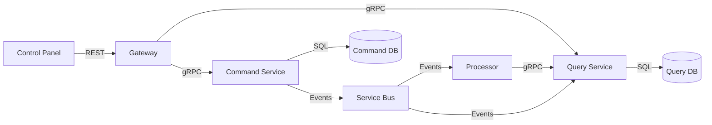
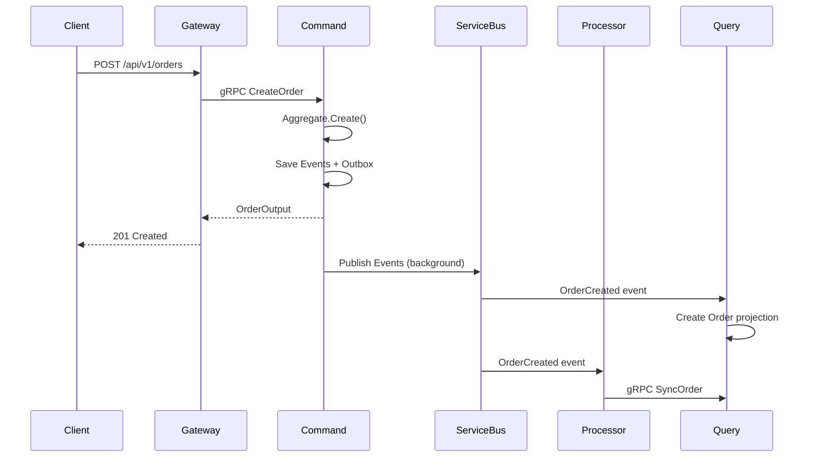
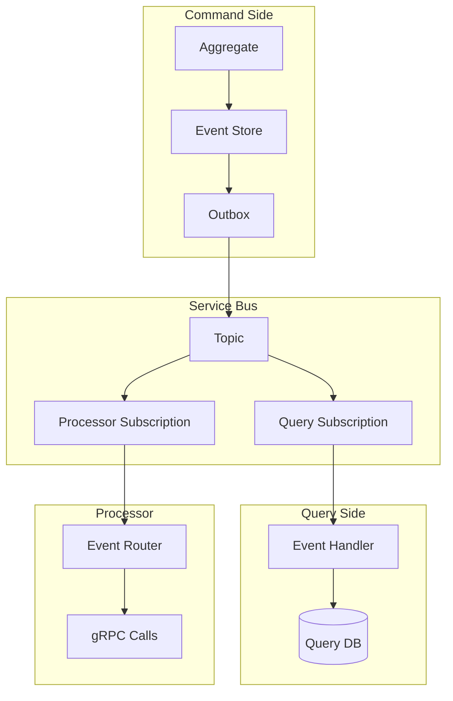
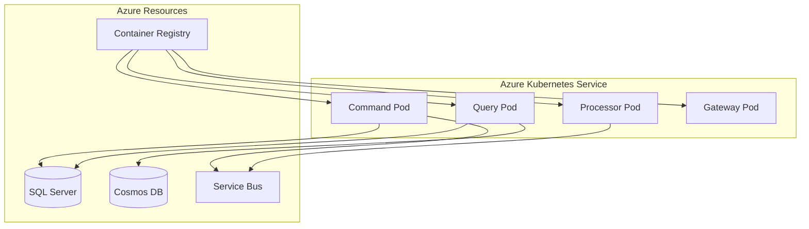

# Architecture Docs — Overview & Diagrams

## Core Principles

- Architecture docs provide high-level system understanding
- Mermaid diagrams are code-based and version-controlled
- Service topology shows how services communicate
- Event flow diagrams show event production and consumption
- Data flow diagrams show information movement through the system

## Key Patterns

### System Architecture Overview

```markdown
# {Domain} System Architecture

## Overview
The {Domain} system follows a CQRS + Event Sourcing microservice architecture.
Commands produce events that are projected to read models.

## Services
| Service | Purpose | Database | Communication |
|---|---|---|---|
| {domain}-command | Event sourcing, business logic | SQL Server | gRPC (server) |
| {domain}-query | Read projections | SQL Server | gRPC (server) |
| {domain}-cosmos-query | NoSQL projections | Cosmos DB | gRPC (server) |
| {domain}-processor | Event routing | None | gRPC (client), Service Bus |
| {domain}-gateway | REST API | None | gRPC (client) |
| {domain}-controlpanel | Admin UI | None | REST (client) |
```

### Service Topology Diagram



### Event Flow Diagram



### Data Flow Diagram



### Infrastructure Diagram



## Anti-Patterns

| Anti-Pattern | Correct Approach |
|---|---|
| Image-based diagrams | Use Mermaid (version-controlled, editable) |
| Outdated architecture docs | Generate/update from project analysis |
| Missing service dependencies | Document all communication paths |
| No data flow documentation | Show how data moves through the system |

## Detect Existing Patterns

```bash
# Find existing architecture docs
find . -name "*architecture*" -o -name "*overview*" | grep -i ".md"

# Find Mermaid diagrams
grep -r "```mermaid" --include="*.md" docs/

# Find service references
grep -r "AddGrpcClient\|ServiceBusClient" --include="*.cs" src/
```

## Adding to Existing Project

1. **Check for existing architecture docs** in `docs/` directory
2. **Update diagrams** when adding new services or changing communication
3. **Use Mermaid** syntax for all diagrams (renders in GitHub)
4. **Document event flows** for each major feature
5. **Keep service table** updated with current services and their purposes
