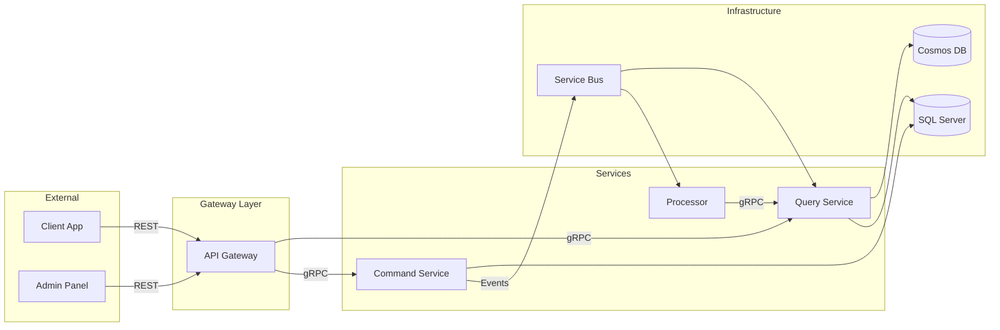
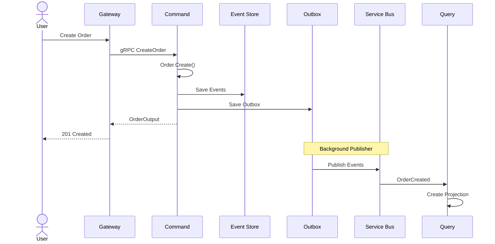
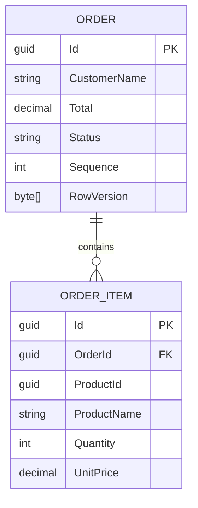
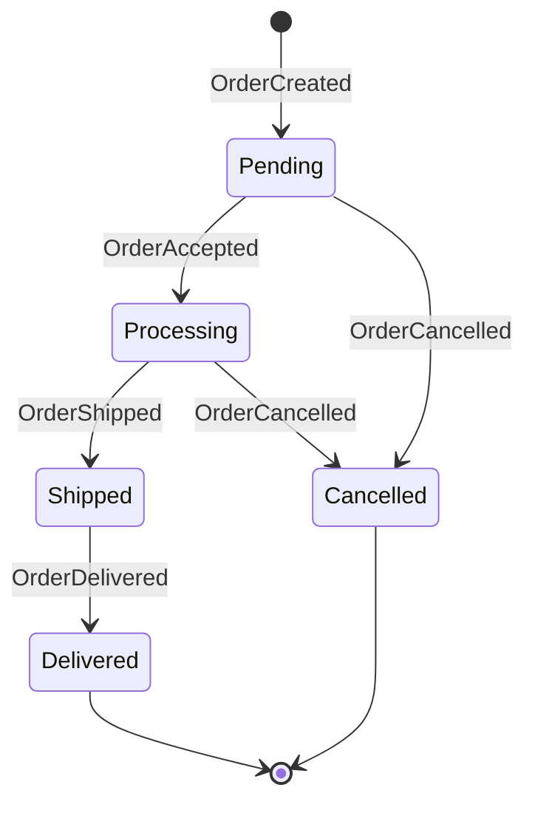
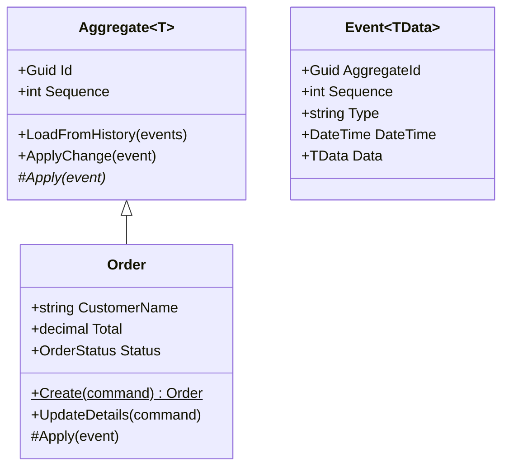
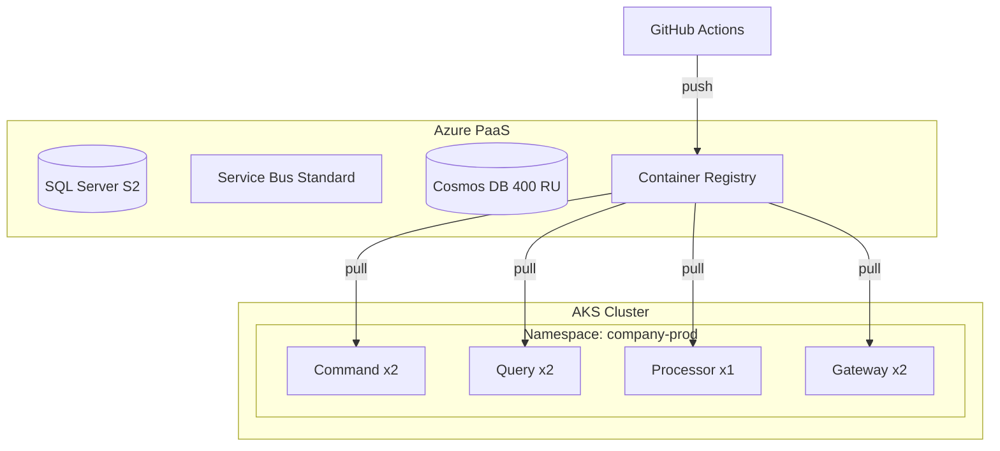

# Diagram Generation — Mermaid Patterns

## Core Principles

- Mermaid diagrams are code-based, version-controlled, and render in GitHub
- Use for service topology, event flows, data flows, and sequence diagrams
- Generate from project analysis where possible
- Keep diagrams focused — one concept per diagram
- Update diagrams when architecture changes

## Key Patterns

### Service Topology (Graph)



### Event Flow (Sequence Diagram)



### Entity Relationship (ER Diagram)



### State Machine (State Diagram)



### Class Diagram (Simplified)



### Deployment Diagram



## Diagram Selection Guide

| Purpose | Diagram Type | Mermaid Syntax |
|---|---|---|
| Service communication | Graph/Flowchart | `graph LR/TB` |
| Request flow | Sequence Diagram | `sequenceDiagram` |
| Data model | ER Diagram | `erDiagram` |
| Entity lifecycle | State Diagram | `stateDiagram-v2` |
| Class hierarchy | Class Diagram | `classDiagram` |
| Deployment topology | Graph | `graph TB` with subgraphs |

## Anti-Patterns

| Anti-Pattern | Correct Approach |
|---|---|
| Image-based diagrams in repo | Use Mermaid for version control |
| Overly complex single diagram | Split into focused diagrams |
| Diagrams without context | Add title and brief description |
| Stale diagrams | Update when architecture changes |

## Detect Existing Patterns

```bash
# Find Mermaid diagrams
grep -rl "```mermaid" --include="*.md" .

# Find diagram files
find . -name "*diagram*" -o -name "*flow*" | grep -i ".md"
```

## Adding to Existing Project

1. **Use Mermaid** for all new diagrams (renders in GitHub/GitLab)
2. **One diagram per concept** — don't combine too many ideas
3. **Place in `docs/` directory** alongside architecture docs
4. **Reference from README** and onboarding docs
5. **Update on architecture changes** as part of the PR
