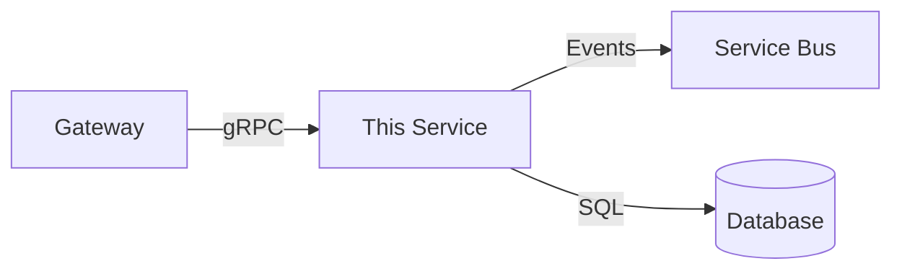
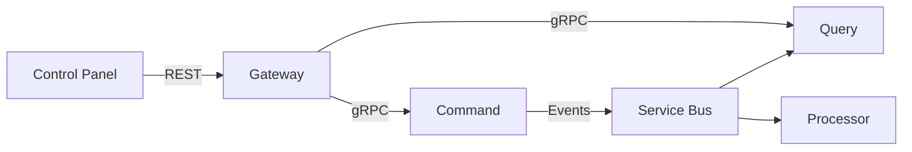

# README Generation — Project Analysis

## Core Principles

- README is generated from project analysis, not written from scratch
- Includes badges, setup instructions, architecture overview, and API summary
- Microservice mode: per-repo README + umbrella README
- Generic mode: single comprehensive README
- Detect existing README and merge/update rather than overwrite

## Key Patterns

### Per-Service README Template

```markdown
# {Company}.{Domain}.{Side}

{Brief description of what this service does}

## Badges


## Overview
{One-paragraph description of the service purpose and role in the system}

## Architecture
This is the **{side}** service in the {Domain} microservice system.



## Prerequisites
- .NET SDK {version}
- Docker (for local infrastructure)
- Azure CLI (for deployment)

## Getting Started

### Local Development
```bash
# Clone
git clone {repo-url}
cd {repo-name}

# Restore and build
dotnet restore
dotnet build

# Run (requires local SQL Server)
dotnet run --project src/{Company}.{Domain}.{Side}
```

### With .NET Aspire
```bash
cd {domain}-apphost
dotnet run
```

## Project Structure
```
src/
  {Company}.{Domain}.{Side}/         # Main application
  {Company}.{Domain}.{Side}.Domain/  # Domain entities
  {Company}.{Domain}.{Side}.Application/ # Handlers, queries
  {Company}.{Domain}.{Side}.Infrastructure/ # DB, Service Bus
tests/
  {Company}.{Domain}.{Side}.Tests/   # Unit + integration tests
```

## API / Events

### Events Produced (Command Side)
| Event | Description |
|---|---|
| OrderCreated | New order created |
| OrderUpdated | Order details changed |

### gRPC Services (Query Side)
| Service | RPC | Description |
|---|---|---|
| OrderQueries | GetOrder | Get order by ID |
| OrderQueries | GetOrders | List with pagination |

## Configuration
Key configuration in `appsettings.json`:
| Key | Description | Required |
|---|---|---|
| ConnectionStrings:DefaultConnection | SQL Server | Yes |
| ServiceBus:ConnectionString | Azure Service Bus | Yes |
| ExternalServices:QueryServiceUrl | Query service URL | Yes |

## Testing
```bash
dotnet test                    # All tests
dotnet test --filter Unit      # Unit tests only
dotnet test --filter Integration # Integration tests only
```

## Deployment
See [Deployment Runbook](docs/runbook.md) for detailed instructions.
```

### Umbrella README (Multi-Service)

```markdown
# {Company} {Domain} Platform

## System Overview
{Domain} is a microservice platform using CQRS + Event Sourcing.

## Services
| Service | Repository | Purpose |
|---|---|---|
| Command | [{domain}-command]({url}) | Event sourcing, business logic |
| Query | [{domain}-query]({url}) | Read projections (SQL) |
| Cosmos Query | [{domain}-cosmos-query]({url}) | Read projections (Cosmos) |
| Processor | [{domain}-processor]({url}) | Event routing |
| Gateway | [{domain}-gateway]({url}) | REST API |
| Control Panel | [{domain}-controlpanel]({url}) | Admin UI |

## Architecture


## Quick Start
See [Onboarding Guide](docs/onboarding.md) for complete setup.

## Documentation
- [Architecture](docs/architecture.md)
- [ADRs](docs/adr/)
- [Deployment Runbook](docs/runbook.md)
```

### Analysis for README Generation

```bash
# Detect project type
find . -name "*.csproj" | head -5

# Get .NET version
grep "TargetFramework" Directory.Build.props 2>/dev/null || \
  grep "TargetFramework" src/*/*.csproj | head -1

# Find main entry point
find . -name "Program.cs" -path "*/src/*" | head -3

# Find gRPC services
grep -r "MapGrpcService\|MapScalarApiReference" --include="*.cs" src/

# Find tests
find . -name "*Tests*" -type d | head -5
```

## Anti-Patterns

| Anti-Pattern | Correct Approach |
|---|---|
| Manually written README that goes stale | Generate from project analysis |
| Missing setup instructions | Always include prerequisites and steps |
| No architecture overview | Include Mermaid diagram |
| Copy-paste from other projects | Analyze this specific project |
| README without badges | Add build status and .NET version badges |

## Detect Existing Patterns

```bash
# Find existing README
find . -name "README.md" -maxdepth 2

# Check README content
head -20 README.md 2>/dev/null

# Find documentation directory
ls docs/ 2>/dev/null
```

## Adding to Existing Project

1. **Read existing README** before generating — preserve custom sections
2. **Update outdated sections** rather than full rewrite
3. **Add missing sections** (badges, architecture, setup)
4. **Verify all commands** in setup instructions actually work
5. **Keep README concise** — link to detailed docs instead of embedding
