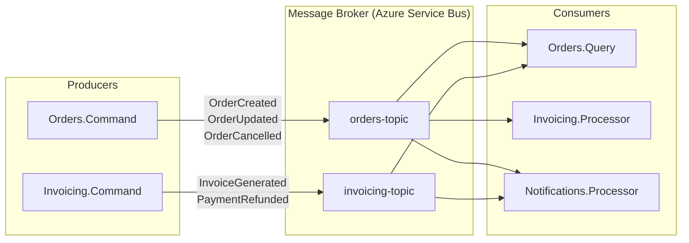
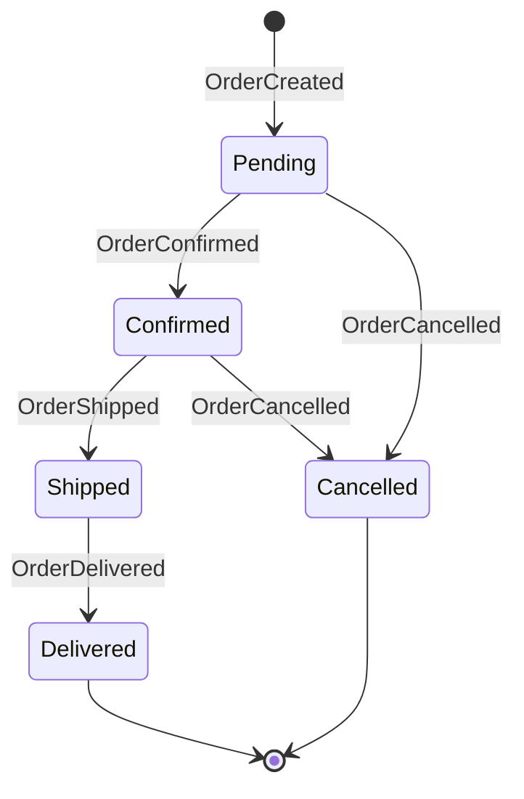

# Event Catalogue -- Schema Registry for CQRS Microservices

## Core Principles

- **Single source of truth** -- the C# `Event<TData>` types ARE the catalogue; documentation is generated, not hand-written
- **Versioned schemas** -- every event carries a `Version` field; the catalogue tracks all active versions
- **Discoverable registry** -- developers find events by domain, aggregate, or event type without reading source code
- **Past-tense naming** -- events describe something that already happened (`OrderCreated`, never `CreateOrder`)
- **Domain-scoped** -- event names are prefixed by the aggregate or bounded context they belong to
- **Cross-service contracts** -- consuming services reference the catalogue, not the producing service's source code
- **Immutable history** -- once an event version is published, its schema never changes

## When to Use

- Multiple services consume events and need a shared understanding of schemas
- Onboarding developers who need to discover which events exist and what they carry
- API-style governance over event contracts across teams
- Generating AsyncAPI or OpenAPI-style documentation for event-driven architectures
- Auditing which events flow between services and their payload shapes

## When NOT to Use

- Single-service monolith where all producers and consumers share the same codebase
- Prototyping phase where event schemas change hourly
- Fewer than 3 event types total -- the overhead exceeds the benefit
- Events are purely internal to one aggregate with no external subscribers

## Patterns

### Event Naming Conventions

All event names follow a strict pattern: `{Aggregate}{PastTenseVerb}`.

```
OrderCreated          -- aggregate creation
OrderUpdated          -- aggregate field changes
OrderItemsAdded       -- collection modification
OrderItemsRemoved     -- collection modification
OrderCompleted        -- state transition
OrderCancelled        -- state transition
InvoiceGenerated      -- derived aggregate creation
PaymentRefunded       -- financial reversal
```

Rules:
- Always past tense (`Created`, `Updated`, `Cancelled`, never `Create`, `Update`, `Cancel`)
- Aggregate name first, then the verb (`OrderCreated`, not `CreatedOrder`)
- No generic names (`DataChanged`, `EntityUpdated`) -- be specific about what changed
- State transitions use the target state (`OrderCompleted`, not `OrderFinished`)
- Collection operations specify the action and target (`OrderItemsAdded`, not `OrderModified`)

### Sealed Records for Event Data

Use sealed records for event data types to prevent inheritance and guarantee immutability:

```csharp
namespace Acme.Orders.Commands.Domain.Events.DataTypes;

public sealed record OrderCreatedData(
    string CustomerName,
    string CustomerEmail,
    decimal Total,
    OrderStatus Status,
    List<OrderLineItem> LineItems
) : IEventData
{
    public EventType Type => EventType.OrderCreated;
}

public sealed record OrderLineItem(
    Guid ProductId,
    string ProductName,
    int Quantity,
    decimal UnitPrice);

public sealed record OrderCancelledData(
    string Reason,
    Guid? CancelledByUserId
) : IEventData
{
    public EventType Type => EventType.OrderCancelled;
}
```

Key details:
- `sealed` prevents subclassing -- each event data type is a leaf in the hierarchy
- Positional record syntax makes all properties `init`-only by default
- Nested records (`OrderLineItem`) document composite payloads without implementing `IEventData`

### Event Schema Documentation Format

Each event in the catalogue follows a standard documentation block:

```markdown
## OrderCreated (v2)

| Field           | Type              | Required | Description                          |
|-----------------|-------------------|----------|--------------------------------------|
| CustomerName    | string            | Yes      | Full name of the ordering customer   |
| CustomerEmail   | string?           | No       | Email address (added in v2)          |
| Total           | decimal           | Yes      | Order total including tax            |
| Status          | OrderStatus       | Yes      | Initial status (always Pending)      |
| LineItems       | List<OrderLineItem> | Yes   | Products in the order                |

**Aggregate:** Order
**Produced by:** Orders.Command
**Consumed by:** Orders.Query, Invoicing.Processor, Notifications.Processor
**Version history:** v1 (2024-01), v2 (2024-06 -- added CustomerEmail)
```

### Cross-Service Event Registry

#### Per-Service Registry (Recommended)

Each service maintains its own `events.json` manifest listing the events it produces:

```json
{
  "$schema": "event-catalogue/v1",
  "service": "Orders.Command",
  "domain": "Orders",
  "events": [
    {
      "name": "OrderCreated",
      "aggregate": "Order",
      "version": 2,
      "dataType": "OrderCreatedData",
      "namespace": "Acme.Orders.Commands.Domain.Events.DataTypes",
      "fields": [
        { "name": "CustomerName", "type": "string", "required": true },
        { "name": "CustomerEmail", "type": "string?", "required": false },
        { "name": "Total", "type": "decimal", "required": true },
        { "name": "Status", "type": "OrderStatus", "required": true },
        { "name": "LineItems", "type": "List<OrderLineItem>", "required": true }
      ],
      "consumers": ["Orders.Query", "Invoicing.Processor", "Notifications.Processor"]
    },
    {
      "name": "OrderCancelled",
      "aggregate": "Order",
      "version": 1,
      "dataType": "OrderCancelledData",
      "namespace": "Acme.Orders.Commands.Domain.Events.DataTypes",
      "fields": [
        { "name": "Reason", "type": "string", "required": true },
        { "name": "CancelledByUserId", "type": "Guid?", "required": false }
      ],
      "consumers": ["Orders.Query", "Invoicing.Processor"]
    }
  ]
}
```

#### Centralized Registry (Alternative)

A single `event-registry/` repository aggregates all per-service manifests. Use this when:
- A dedicated platform team owns cross-cutting concerns
- CI pipelines validate consumer compatibility on every PR
- You need a single portal for event discovery

### Catalogue Generation from C# Types

Generate the catalogue by reflecting over `IEventData` implementations at build time:

```csharp
namespace Acme.Shared.EventCatalogue;

public sealed class EventCatalogueGenerator
{
    public static List<EventSchemaEntry> GenerateFromAssembly(Assembly assembly)
    {
        var entries = new List<EventSchemaEntry>();

        var eventDataTypes = assembly.GetTypes()
            .Where(t => t.IsAssignableTo(typeof(IEventData))
                        && t is { IsInterface: false, IsAbstract: false });

        foreach (var type in eventDataTypes)
        {
            var instance = Activator.CreateInstance(type, nonPublic: true);
            var eventType = type.GetProperty("Type")?.GetValue(instance);

            var fields = type.GetConstructors()
                .First()
                .GetParameters()
                .Select(p => new FieldEntry(
                    Name: p.Name!,
                    Type: FormatTypeName(p.ParameterType),
                    Required: !IsNullable(p)))
                .ToList();

            entries.Add(new EventSchemaEntry(
                Name: eventType?.ToString() ?? type.Name,
                DataType: type.Name,
                Namespace: type.Namespace ?? string.Empty,
                Fields: fields));
        }

        return entries;
    }

    private static string FormatTypeName(Type type)
    {
        if (Nullable.GetUnderlyingType(type) is { } underlying)
            return $"{underlying.Name}?";
        if (type.IsGenericType && type.GetGenericTypeDefinition() == typeof(List<>))
            return $"List<{type.GenericTypeArguments[0].Name}>";
        return type.Name;
    }

    private static bool IsNullable(ParameterInfo param) =>
        Nullable.GetUnderlyingType(param.ParameterType) is not null
        || new NullabilityInfoContext().Create(param).WriteState == NullabilityState.Nullable;
}

public sealed record EventSchemaEntry(
    string Name,
    string DataType,
    string Namespace,
    List<FieldEntry> Fields);

public sealed record FieldEntry(
    string Name,
    string Type,
    bool Required);
```

Usage in a build-time tool or test:

```csharp
var assembly = typeof(OrderCreatedData).Assembly;
var catalogue = EventCatalogueGenerator.GenerateFromAssembly(assembly);
var json = JsonSerializer.Serialize(catalogue, new JsonSerializerOptions
{
    WriteIndented = true,
    PropertyNamingPolicy = JsonNamingPolicy.CamelCase
});
File.WriteAllText("events.json", json);
```

### Mermaid Event Flow Diagrams

Generate a Mermaid diagram showing event producers, consumers, and the message broker:



Per-aggregate event lifecycle diagram:



### Build-Time Catalogue Validation

Add a test that verifies the catalogue stays in sync with the code:

```csharp
public sealed class EventCatalogueTests
{
    [Fact]
    public void AllEventDataTypes_AreDocumentedInCatalogue()
    {
        var assembly = typeof(OrderCreatedData).Assembly;
        var actual = EventCatalogueGenerator.GenerateFromAssembly(assembly);
        var catalogueJson = File.ReadAllText("events.json");
        var documented = JsonSerializer.Deserialize<List<EventSchemaEntry>>(catalogueJson)!;

        var undocumented = actual
            .Where(a => !documented.Any(d => d.DataType == a.DataType))
            .ToList();

        Assert.Empty(undocumented);
    }

    [Fact]
    public void AllEventDataTypes_AreSealedRecords()
    {
        var assembly = typeof(OrderCreatedData).Assembly;
        var eventDataTypes = assembly.GetTypes()
            .Where(t => t.IsAssignableTo(typeof(IEventData))
                        && t is { IsInterface: false, IsAbstract: false });

        foreach (var type in eventDataTypes)
        {
            Assert.True(type.IsSealed,
                $"{type.Name} must be sealed");
            Assert.True(type.GetMethod("<Clone>$") is not null,
                $"{type.Name} must be a record (missing Clone method)");
        }
    }
}
```

## Decision Guide

| Scenario | Approach | Reason |
|---|---|---|
| 2-3 services, same team | Per-service `events.json` checked into each repo | Low overhead, discoverable via code search |
| 5+ services, multiple teams | Centralized registry repo with CI validation | Single portal, contract-breaking detection |
| Strict governance required | Generated catalogue + build-time validation tests | Prevents undocumented events from shipping |
| Rapid prototyping | Skip formal catalogue, use code as documentation | Avoid ceremony that slows iteration |
| AsyncAPI compliance needed | Generate AsyncAPI spec from `events.json` manifests | Industry-standard format for event docs |
| Event schemas rarely change | Per-service manifest, manual updates | Reflection-based generation is overkill |
| Event schemas change frequently | Build-time generation + test enforcement | Manual updates fall out of sync |

## Anti-Patterns

| Anti-Pattern | Correct Approach |
|---|---|
| Hand-writing event docs in a wiki | Generate from `IEventData` types; code is the source of truth |
| Using present-tense event names (`CreateOrder`) | Past tense only (`OrderCreated`) -- events describe facts |
| Generic event names (`DataChanged`, `Updated`) | Specific names scoped to aggregate (`OrderItemsAdded`) |
| Mutable classes for event data | Sealed records with positional syntax |
| No version tracking in catalogue | Include version number and version history per event |
| Centralized registry without CI checks | Validate consumer compatibility on every PR |
| Documenting events without listing consumers | Always track which services consume each event |
| Catalogue only in Confluence/wiki | Keep catalogue in the repo (generated or checked in) |
| Skipping nested type documentation | Document composite types like `OrderLineItem` alongside the parent |
| One giant `EventData` class with optional fields | Separate sealed record per event type |

## Detect Existing Patterns

```bash
# Find all IEventData implementations
grep -r ": IEventData" --include="*.cs" src/

# Find existing event catalogue or registry files
find . -name "events.json" -o -name "event-catalogue*" -o -name "event-registry*"

# Find EventType enums across services
grep -r "enum EventType" --include="*.cs" src/

# Find sealed record event data types
grep -r "sealed record.*Data" --include="*.cs" src/

# Find existing Mermaid diagrams referencing events
grep -r "OrderCreated\|EventType\|event-topic" --include="*.md" docs/
```

## Adding to Existing Project

1. **Audit existing events** -- run `grep -r ": IEventData" --include="*.cs"` to find all event data types
2. **Ensure sealed records** -- convert any non-sealed event data classes to `sealed record` with positional syntax
3. **Create `EventCatalogueGenerator`** in a shared project or test project
4. **Generate initial `events.json`** by running the generator against each command service assembly
5. **Add consumer metadata** -- list which query/processor services subscribe to each event topic
6. **Add build-time validation test** to prevent undocumented events from merging
7. **Generate Mermaid diagrams** for each bounded context showing producer/broker/consumer flow
8. **Establish naming review** -- PR reviewers check that new events follow `{Aggregate}{PastTenseVerb}` convention
